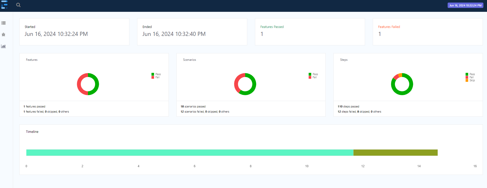
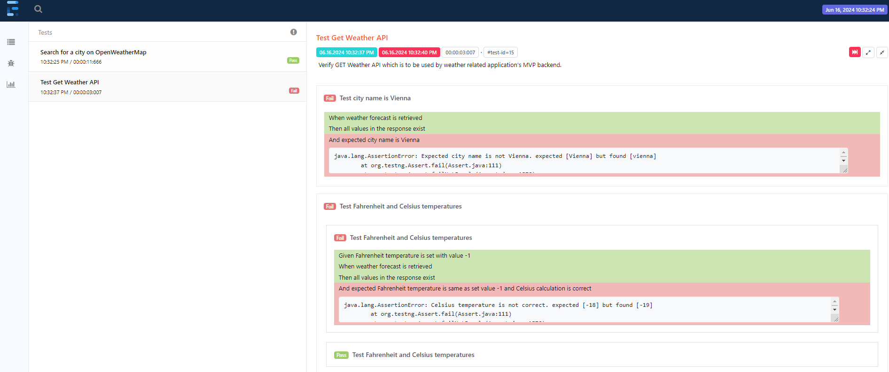

# Weather-API-test project
This is a sample _java maven_ project for automation testing of:
* **weather API** service used by weather related application's **backend**.
* **OpenWeatherMap** web page.

All test cases are implemented with _Cucumber BDD_ approach, based on predefined acceptance criteria.

Languages, frameworks and technologies used in the test project:
* Java
* Maven and POM
* BDD and Cucumber automated tests
* TestNG
* ExtentReports
* Selenium

## Run tests
Prerequisites to run the tests:
* java 17
* maven
* Chrome browser
* Chrome driver corresponding to the Chrome browser version 


  To run all the tests - in current project folder (weather-api-test) execute following _maven_ command which requires local Chrome driver path:
```mvn test -Dwebdriver.chrome.driver=<local file system path to Chrome driver> ``` 

## Test report generation
After every test run completion, a detailed test report is generated automatically as a HTML document under:
    ``` ./target/test-reports/weather-api.html ```

### Remove generated report and classes
To clean generated test report and classes, in current project folder (weather-api-test) execute following _maven_ command:
```mvn clean ``` 

### Test report results example
Parts from already executed tests and generated report:




Locally can be open previously generated report at :
``` ./weather-api-test/weather-api-test-report-20240616-1032.html ```


